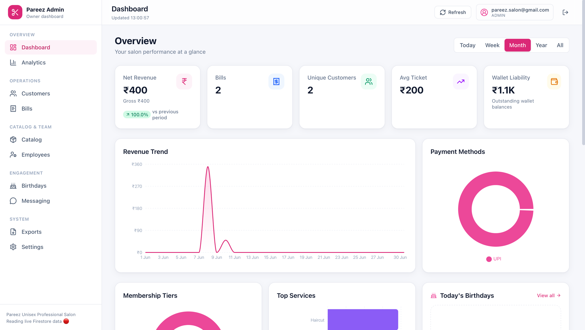
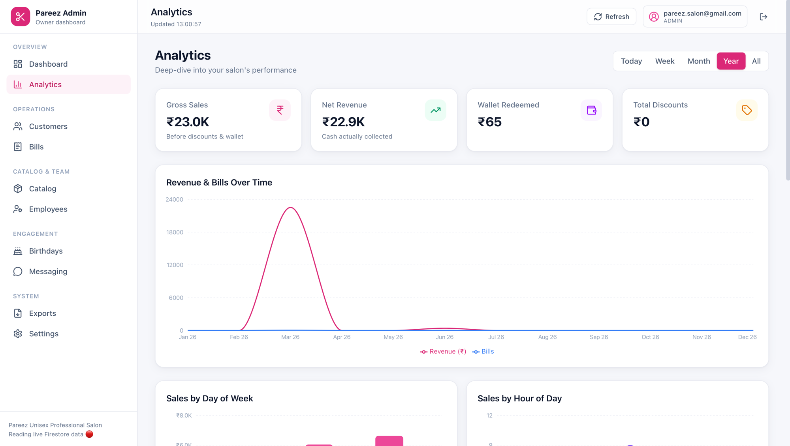
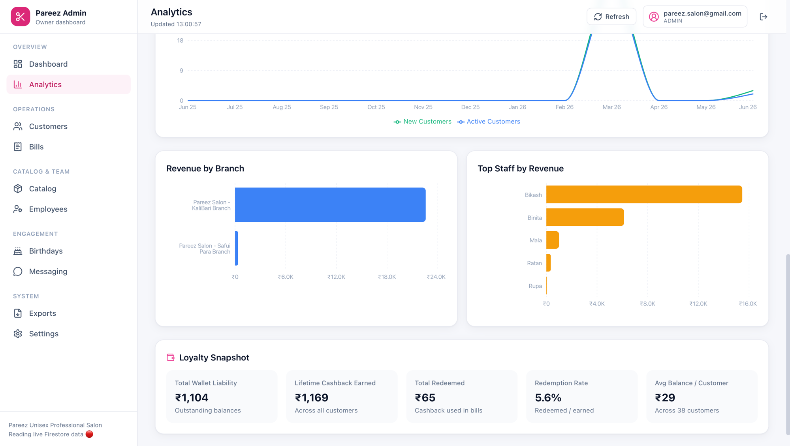
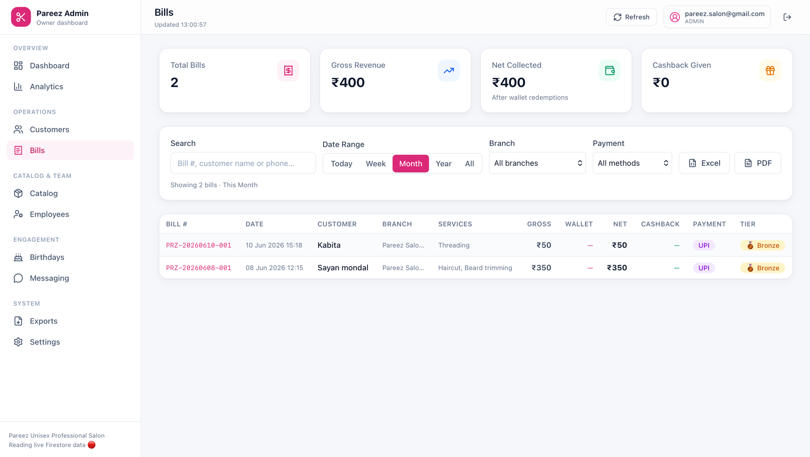
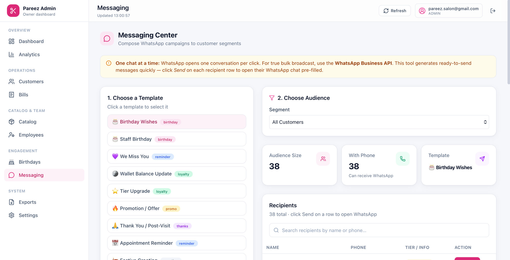
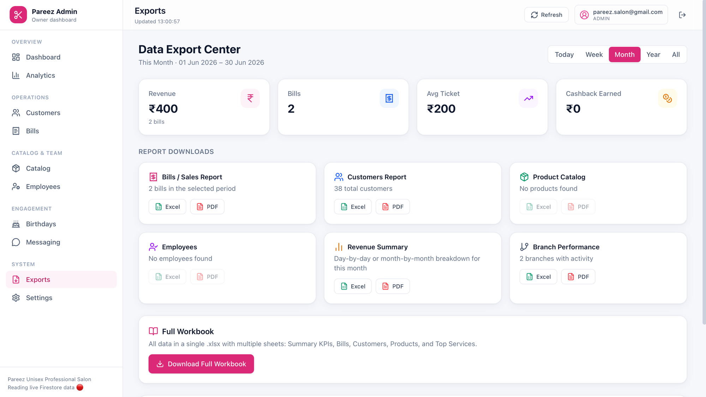
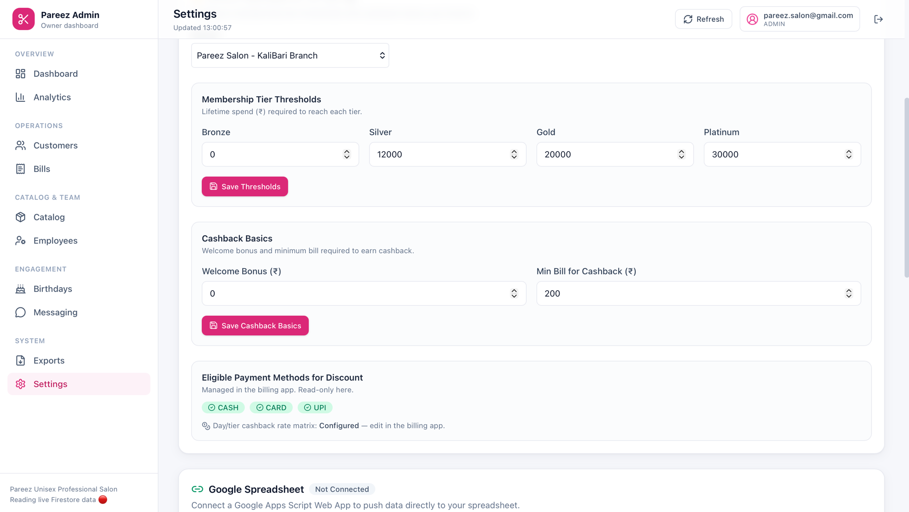

# Pareez Billing — Owner Admin Dashboard

A complete, standalone admin dashboard for **Pareez Unisex Professional Salon**. It reads the
**same Firestore database** as the [`pareez-billing`](../pareez-billing) point-of-sale app
(Firebase project `pareez-billing`), so every bill created at the counter shows up here in real
time — no data duplication, no syncing.

Built with **Next.js 16 (App Router) · React 19 · TypeScript · Tailwind CSS 4 · Firebase 11 ·
Recharts · jsPDF · SheetJS (xlsx)** — matching the billing app's stack.

---

## 📸 Screenshots

### Dashboard — salon performance at a glance


### Analytics — revenue, bills & customer growth over time


### Analytics — revenue by branch, top staff & loyalty snapshot


### Bills — searchable bill history with filters & exports


### Messaging Center — WhatsApp templates & audience segments


### Exports — download Excel / PDF reports & full workbook


### Settings — tier thresholds, cashback basics & Google Sheets


---

## ✨ Features

### 📊 Dashboard & Analytics
- KPI cards with period-over-period change (revenue, bills, customers, avg ticket, wallet liability)
- Revenue trend (area), payment-method split (donut), membership-tier distribution
- Top services, top customers, top staff, revenue by branch
- Sales by **day-of-week** and **by hour** of day
- Customer growth (new vs active, 12 months), loyalty snapshot (earned/redeemed/redemption rate)
- Date-range filter everywhere: **today / week / month / year / all-time**

### 👥 Customers
- Full searchable directory (by name or phone), tier & sort filters
- Per-customer drawer: wallet balance, lifetime spend/earned/redeemed, tier, age & birthday countdown
- Bill history + full wallet transaction audit trail per customer
- One-click WhatsApp message with templates
- Export the filtered list to Excel / PDF

### 🧾 Bills
- Search by bill number / customer / phone, with branch, payment-method & date filters
- Full bill detail (services, staff, discounts, wallet usage, cashback, totals breakdown)
- Share any bill on WhatsApp · export to Excel / PDF with summary totals

### 📦 Product / Service Catalog *(new collection)*
- **Add / edit / delete** products & services — name, category, price, duration, SKU, branch, status
- Search & filter by category / status · export catalog

### 🧑‍🔧 Employees *(new collection)*
- **Add / edit / delete** staff — designation, phone, email, DOB, joining date, branch, status
- Birthday indicators · send WhatsApp birthday wishes · export staff list

### 🎂 Birthday Center
- See **whose birthday is today** (customers *and* employees) plus this week / month
- Festive UI · age & countdown · one-click WhatsApp wishes using birthday templates

### 💬 Messaging Center
- Predefined WhatsApp **message templates** (birthday, win-back, loyalty, tier-upgrade, promo,
  thank-you, reminder, festive) with live preview & editable variables
- **Audience segments**: all / by tier / inactive 60d+ / has wallet balance / top spenders /
  today's birthdays / employees
- Per-recipient WhatsApp **intent links** (click-to-chat) · quick-send to any number

### 📤 Exports & Google Sheets
- Export **daily / weekly / monthly / annual** data to **Excel, PDF and CSV**
- Multi-sheet "full workbook" export
- **Connect a Google Spreadsheet** (via a tiny Apps Script web app) and push bills/customers to it

### ⚙️ Settings
- Edit branch **tier thresholds** and **cashback basics** (welcome bonus, min bill) — writes to
  the same `branches/{id}/config` documents the billing app reads
- Connect / disconnect the Google Sheet webhook (with copy-paste Apps Script)
- Account & about

---

## 🚀 Getting started

```bash
cd pareez-billing-admin-dashboard
npm install
npm run dev        # http://localhost:3001
```

The Firebase config in `.env` already points at the shared `pareez-billing` project. To use a
different project, copy `.env.example` → `.env` and fill it in.

### Sign in
Use an account with the **`admin`** custom claim (the billing app's `scripts/set-user-claims.js`
sets these). Non-admin accounts are rejected at login. The dashboard runs on port **3001** so it
can run alongside the billing app (port 3000).

---

## 🔐 Firestore security rules (important)

The dashboard introduces two **new** collections — `products` and `employees` — that don't exist
in the billing app. Firestore denies access to collections without a matching rule, so you must
add rules for them. Deploy the included [`firestore.rules`](./firestore.rules) (it mirrors the
billing app's existing rules **and** adds the two new collections):

```bash
# from a checkout that has firebase-tools configured for the pareez-billing project
firebase deploy --only firestore:rules
```

Until these rules are live, the **Catalog** and **Employees** pages will show empty / permission
errors, but every other page works (those collections already have rules).

---

## 🌱 Seed sample catalog & staff

The catalog and staff start empty. Populate realistic demo data:

```bash
# put a service-account key at scripts/serviceAccountKey.json first
node scripts/seed-demo-data.js            # dry run
node scripts/seed-demo-data.js --commit   # write products + employees
```

This only writes to `products` and `employees` — it never touches customers, bills or wallets.

---

## 📈 Connecting Google Sheets

1. Open your Google Sheet → **Extensions → Apps Script**.
2. Paste the script shown on the **Settings → Google Spreadsheet** page (also in
   `src/lib/google-sheets.ts`).
3. **Deploy → New deployment → Web app** · *Execute as: Me* · *Who has access: Anyone*.
4. Copy the `/exec` URL and paste it into Settings. Now the **Exports** page can push bills &
   customers straight into your sheet.

The webhook URL is stored in your browser's `localStorage` only — no secrets are written to the
database.

---

## 🗂️ Data model

Reads (live): `branches`, `customers` (embedded wallet + tier), `bills`, `walletTransactions`,
`branches/{id}/config/{cashbackConfig,tierConfig}`.
Reads + writes (new): `products`, `employees`.
Writes (config): branch tier thresholds & cashback basics.

Shared types live in `src/lib/types.ts` and are kept in sync with the billing app.

---

## 📁 Project structure

```
src/
  app/
    layout.tsx · page.tsx (router) · login/
    (app)/                    ← protected, admin-only shell (sidebar + topbar)
      dashboard · analytics · customers · bills · products
      employees · birthdays · messaging · exports · settings
  components/   ui/ (button, card, input, dialog, table, badge, toast, misc)
                charts/ · StatCard · MessageDialog · Sidebar · Topbar · Providers
  contexts/     AuthContext · DataContext
  lib/          firebase · firestore · types · analytics · export
                whatsapp · google-sheets · currency · auth · utils
scripts/        seed-demo-data.js
firestore.rules
```

---

## 🛠️ Scripts

| Command | Description |
| --- | --- |
| `npm run dev` | Dev server on :3001 |
| `npm run build` | Production build |
| `npm run start` | Serve the production build on :3001 |
| `npm run seed:demo` | Seed sample products & employees (needs service-account key + `--commit`) |

---

Built to pair with the Pareez Billing POS — same database, owner's-eye view. 💖
